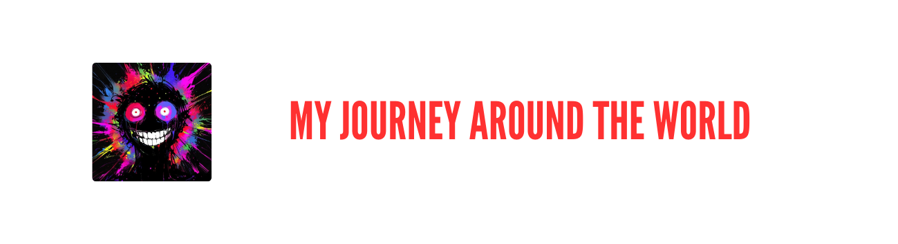

# Likhon Sheikh - Full Stack Developer 🚀

## 👨‍💻 About Me

> "Crafting digital experiences that make a difference"

I'm a passionate Full Stack Developer with a keen eye for design and a love for clean, efficient code. Currently building amazing projects at [@likhon-dev](https://github.com/likhon-dev), I specialize in creating modern web applications that combine stunning interfaces with robust functionality.

- 🔭 Currently working on: Next.js-powered full-stack applications
- 🌱 Learning: Advanced TypeScript patterns and Cloud Architecture
- 👯 Looking to collaborate on: Open source projects and innovative web applications
- 💬 Ask me about: Modern web development, UI/UX design, and system architecture
- ⚡ Fun fact: I contribute to open-source projects while enjoying a cup of ☕

## 🛠️ Technical Arsenal

### Frontend Development

### Backend & Database

### DevOps & Tools

## 📈 GitHub Analytics

## 🎯 Featured Projects

### 1. Project Name
> Description of the project goes here
- Tech Stack: React, Node.js, MongoDB
- [View Project](project-link) | [GitHub](github-link)

### 2. Project Name
> Description of the project goes here
- Tech Stack: Next.js, TypeScript, PostgreSQL
- [View Project](project-link) | [GitHub](github-link)

## 📫 Let's Connect

### Follow my journey! 🌟

---

💻 with ❤️ by Likhon Sheikh | Last updated: January 2025

